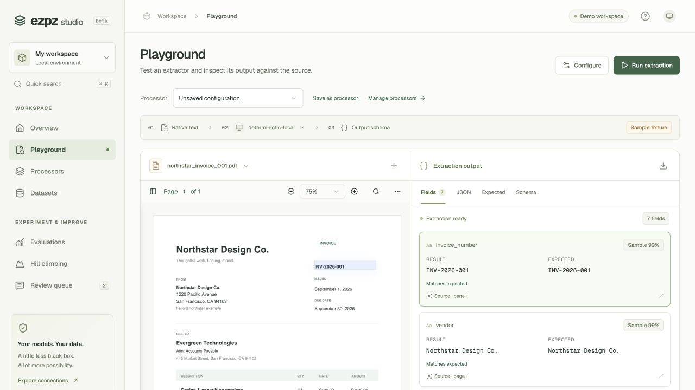
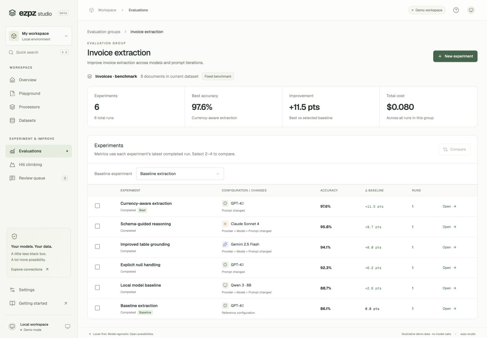

<div align="center">

# ezpz studio

### Your documents. Your models. Measurable extraction.

A local-first workbench for building document extractors, comparing experiments, and turning reviewer feedback into better results.

**Model-agnostic · Locally hostable · MIT licensed**

[Quick start](#quick-start) · [How it works](#how-it-works) · [Configuration](docs/configuration.md) · [Contributing](CONTRIBUTING.md) · [Security](SECURITY.md)

</div>



*The screenshots use synthetic demo documents. Their scores are illustrative, not model benchmarks.*

## Why ezpz?

Getting JSON out of a document is only the beginning. You also need to see where each value came from, measure what changed when you edit a prompt, and understand why one configuration works better than another.

ezpz brings that loop into one workspace. Keep the source document beside your schema and results. Save reusable processors for invoices, 1099s, receipts, contracts, or your own document types. Build a benchmark, compare experiments, and inspect the fields behind the score—all while choosing your own model and parser.

ezpz uses open-source Extend UI components for document viewing and schema editing, while extraction is handled independently through your configured models and parsers.

> **Project status:** local, single-user beta — **0.1.0-beta.1**. This repository contains the complete React frontend and Python backend. Run the bundled Docker service, or develop both from this checkout. See [deployment and backups](docs/deployment.md) for installation and beta limits.

## What you can do

| Workflow | In the studio |
| --- | --- |
| **Build processors** | Create custom extraction schemas, prompts, model settings, and parser configurations. Save versions and reuse them across documents. |
| **Edit schemas visually** | Use the Extend Schema Builder for nested objects, arrays, enums, descriptions, and field reordering, with a synchronized JSON view. |
| **Inspect extractions** | View the document alongside results and expected values. Follow available source citations; inspect arrays of objects as tables. |
| **Create ground truth** | Correct expected values and add the document plus its annotation to an existing or new evaluation dataset. |
| **Compare experiments** | Give each evaluation group its own benchmark, stats, and experiment pages. Compare 2–4 runs by accuracy, model, prompt, schema, latency, and cost. |
| **Review failures** | Open a saved run, filter incorrect fields, inspect its source documents, and record corrections, acceptance, ambiguity, and reviewer notes. |
| **Improve iteratively** | Use the manual hill-climbing flow to test a prompt refinement, model change, or schema change against a baseline. |

## Quick start

### Explore the demo

From this repository, with **Node.js 22.12+** and npm installed:

```bash
npm ci
npm run dev
```

Open [the demo playground](http://127.0.0.1:5180/?demo=1#Playground).

Demo mode uses labeled sample documents and scores. It makes no model calls. Normal URLs start in live mode and show a connection screen when the backend is unavailable.

### Run your own workspace

With Docker and Compose installed:

```bash
git clone https://github.com/jonmoubayed/ezpz-studio.git
cd ezpz-studio
docker compose up -d --build
```

Open [ezpz studio](http://127.0.0.1:5180). The service includes the frontend, API, native PDF parser, and English OCR. Documents and results persist in a named Docker volume.

The [beta checks workflow](https://github.com/jonmoubayed/ezpz-studio/actions/workflows/ci.yml) produces ARM64 and AMD64 bundles after successful checks. These bundles include the image: extract one and run `./start.sh` (macOS/Linux) or `./start.ps1` (Windows PowerShell). No source build or registry login is needed. See [deployment](docs/deployment.md) for credentials, alternate ports, backup/restore, and upgrades.

Registry publishing is available through the **Publish container image** workflow. Once a version is published, use the [GHCR deployment instructions](docs/deployment.md#pull-a-published-image) to pull it without building from source.

To develop without Docker, use **Node.js 22.12+** and **Python 3.12**:

```bash
python3.12 -m venv .venv
.venv/bin/python -m pip install -r requirements.lock
npm ci
npm start
```

The launcher starts this checkout's backend on port 4173 and the frontend on 5180, or reuses an already-running API. Optional launcher overrides are documented in [Configuration](docs/configuration.md).

The workspace starts without sample documents. No provider key is needed to open it. Select the deterministic adapter explicitly for development fixtures; configure an LLM for general extraction.

### Your first useful experiment

1. **Create a processor.** Start with a template or define a custom schema. Select your model and parser.
2. **Add a document.** Use Playground or the processor's Configure page. Keep the source visible while editing the schema.
3. **Run extraction.** Inspect fields and citations. In **Expected**, enter verified ground truth; optionally copy the extraction as a starting point and correct it.
4. **Build a benchmark.** Add the document and expected values to an evaluation dataset. Repeat for a representative set of documents.
5. **Create an evaluation group.** Choose that dataset, run a baseline experiment, then try a different prompt, model, or schema.
6. **Compare and review.** Select experiments within the group, compare their runs, and open a result to inspect incorrect fields against the source.

## How it works

| Concept | Responsibility | Example |
| --- | --- | --- |
| **Processor** | A reusable extraction configuration with saved versions | Invoice extraction |
| **Dataset** | A collection of documents used as a benchmark | Reviewed invoice set |
| **Evaluation group** | A shared benchmark and a home for related experiments | Invoice quality |
| **Experiment** | One saved configuration within the group | Currency-aware prompt |
| **Run** | One execution of that configuration, with its own results | The first run and a repeat run |
| **Ground truth** | The verified expected values used for scoring | Correct invoice number and total |

A group opens into its own stats and experiment list. An experiment opens into its configuration and run history. A run opens into document-level results. Repeating a saved configuration adds another run to its experiment.



Group pages show experiment status and saved configurations. Comparisons require completed runs within the group that share the same recorded benchmark snapshot.

Each new evaluation freezes document membership and ground-truth revisions, and performs fresh extraction by default. Editing a dataset or annotation changes the next snapshot. Historical results retain their expectations; incompatible snapshots cannot be compared as the same benchmark.

### Confidence is not accuracy

**Model** confidence is the LLM's self-reported certainty, not a calibrated probability of correctness. **Rule-based** and **Sample** badges identify deterministic and demo scores. Missing or invalid confidence stays unknown; it is never replaced with a made-up percentage.

Evaluation accuracy measures extracted fields against ground truth. An unannotated field remains unscored. Explicit `null`, `false`, and `0` are preserved as values rather than treated as missing annotations.

## Bring your own models and parsers

The model picker includes current suggestions and a **Check for new models** action in the live studio. See [model discovery](docs/model-discovery.md) for refresh behavior and updating the offline catalog.

The backend adapters support OpenAI, Anthropic, Google Gemini, Ollama, and OpenAI-compatible endpoints. You can enter a custom model ID; availability depends on the configured service. Native text, Docling, and LlamaParse are the current parser choices.

Put provider credentials in the **backend's** environment or `.env` file, then restart the backend. Never put provider secrets in frontend `VITE_*` variables. See [provider configuration](docs/configuration.md#models-and-parsers) for the supported environment names and local endpoint setup.

Missing model credentials and provider failures produce explicit errors. The deterministic model is never silently substituted. Optional parser failures may still use compatibility parsing; inspect result warnings when evaluating parser behavior.

## Local hosting and data

- Documents, ground truth, saved processor versions, runs, and review decisions persist in the backend's SQLite database and blob directory, normally `.ezpz/ezpz.db` and `.ezpz/blobs`.
- Browser storage keeps working drafts, UI selections, and demo state. It is separate from the backend database.
- Fonts and the PDF engine are served locally. Model and parser requests follow the providers you select: choosing a hosted service sends the relevant document content to that service.
- The current servers are intended for a trusted local workspace. Authentication, multi-tenant access control, and distributed job scheduling are not included. Dataset evaluations run in the background with progress and cancellation. Keep the default loopback binding for local use.

For backups, stop the backend and copy its database and blob directory together. Save any browser-only processor drafts as versions first. Keep credentials out of shared backups and issue attachments.

## Static demo website

The separate [`demo-site/`](demo-site/) project contains the minimal landing page and browser-only studio demo. Build and host its `dist/` directory without a backend or provider credentials. Sample extractions and evaluations are simulated; selected files stay in the browser. See its [setup and hosting instructions](demo-site/README.md).

## Development

```bash
npm run dev       # Frontend with hot reload; connect a separately running backend
npm start         # Start/reuse the local backend, then start the frontend
npm test          # Unit and component-rendering checks
npm run build     # TypeScript checks and production assets in dist/
npm run preview   # Preview dist/ locally on port 5180
```

Stop the development server before using the preview on the same port. The preview still needs the backend for live data.

Run the API and React store integration tests against a disposable backend:

```bash
EZPZ_TEST_PYTHON=.venv/bin/python npm run test:integration
```

The test runner creates a temporary database and blob directory and cleans them up afterward. It exercises upload, extraction, annotation, dataset membership, processor versions, evaluation groups, repeat runs, and feedback. It uses the deterministic adapter and makes no external model calls.

See [CONTRIBUTING.md](CONTRIBUTING.md) for the source map, contribution workflow, test expectations, and container checks.

## Troubleshooting

| Symptom | Check |
| --- | --- |
| Studio cannot connect | Start the backend and check [its readiness endpoint](http://127.0.0.1:4173/v1/ready). Verify `EZPZ_API_URL` and restart the frontend after changes. |
| PDF parsing is unavailable | Install `requirements.txt` into the interpreter actually used by the backend. |
| A model request fails | Check provider credentials, endpoint, and model ID; restart after changing the environment. No fallback model is substituted. |
| A field has no bounding box | Citations require grounding evidence from the parser/extraction. The studio does not invent source locations. |
| Port `5180` is in use | Stop the other frontend process, or set `EZPZ_STUDIO_PORT` for `npm start`. |
| Two runs cannot be compared | Both must be completed and use the same recorded benchmark snapshot. Older runs may not have one. |

## Current scope

Hill climbing is a **manual experiment loop**, not an autonomous optimizer. Dataset evaluations run in the background, one at a time. Cancellation waits for the current document; interrupted runs are identified after restart and can be rerun. PDF, image, and text/CSV viewing are included; this frontend does not include dedicated DOCX or XLSX viewers. The local deterministic adapter is useful for development and tests, not a general-purpose document understanding model.

Demo metrics are fixtures. They should not be used in model comparisons, performance claims, or benchmark reports.

## Contributing

Bug reports, documentation improvements, accessibility fixes, provider integrations, and extraction/evaluation improvements are welcome. Start with [the contributor guide](CONTRIBUTING.md). Use synthetic documents in issues and tests, and include a minimal reproduction for extraction or scoring bugs.

## License and acknowledgments

Original project code is available under the [MIT License](LICENSE).

The studio builds on [Extend UI](https://www.extend.ai/ui), React, Vite, TypeScript, Radix/shadcn primitives, Lucide, and the EmbedPDF/PDFium viewer. Extend supplies UI components, not a required extraction service.

Upstream license terms and notices remain in effect for third-party code and assets:

- [Extend UI license](EXTEND-LICENSE.md)
- [PDFium notices](licenses/pdfium.txt)
- [Geist](licenses/geist.txt) and [Geist Mono](licenses/geist-mono.txt) font licenses

Local adaptations include resolved icon imports, accessible schema controls, preserved schema constraints, citation handling, and locally served PDF engine assets.
